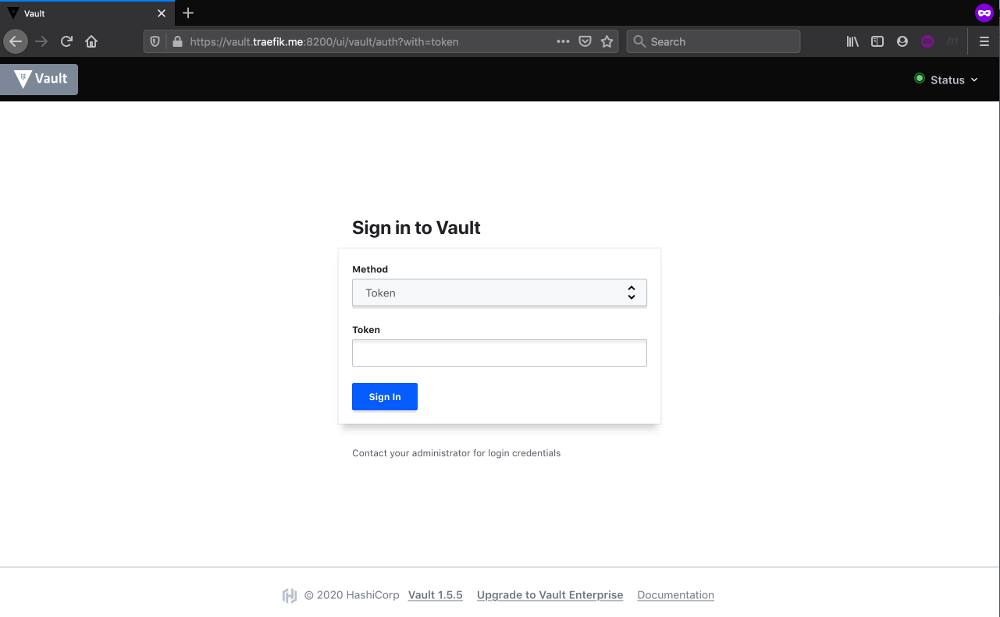

# MiniVault

Fully  fledged local [HashiCorp Vault](https://www.vaultproject.io/) running on top of Docker, ideal for demos and
learning Vault configuration, operations and secrets protection.

<!-- MDTOC maxdepth:6 firsth1:2 numbering:0 flatten:0 bullets:1 updateOnSave:1 -->

- [Requirements](#Requirements)   
- [Quick Start](#Quick-Start)   
- [Usage](#Usage)   
- [Scenarions](#Scenarions)   
- [External resources](#External-resources)   
- [Contributing](#Contributing)   
- [History](#History)   
- [Author](#Author)   
- [License](#License)   

<!-- /MDTOC -->

**What HashiCorp Vault is?**

_HashiCorp is a tol to manage secrets and protect Sensitive Data._

_Secure, store and tightly control access to tokens, passwords, certificates, encryption keys for protecting secrets and other sensitive data using a UI, CLI, or HTTP API._

**What MiniVault is?**

MiniVault is a portable, self contained and easy to spin fully operational vault instance ideal to learn HashiCorp Vault locally on your laptop.

**!!! Disclaimer !!!**

This is by no means a HashiCorp Vault **production** grade setup, **do not expose ports, services, endpoints to the internet.**

## Requirements

- vault
- mkcert
- gomplate
- multitail
- pwgen
- keepassxc
- terraform
- jq

OSX :`brew install vault mkcert gomplate multitail pwgen keepassxc  terraform jq`

## Quick Start

1. `export SECDBPASS="SuperStrongPassword"`

2. `unset VAULT_TOKEN && make build`

3. `source ./envrc.sh`

4. `make get_secure_db_entries_admin_user_password`

5. `make open`

6. Login into vault with: `admin:(password from step 4)`

7. Copy token for admin user.

 
 
 

8. Export admin token as `export VAULT_TOKEN="MyAdminToken"`

9. `make scenario_1_apply`

## Usage

## Scenarions

1. scenario-1 (API tokens distributed across two services)

## External resources

Follow along on https://learn.hashicorp.com/vault

## Contributing

1. Fork it!
2. Create your feature branch: `git checkout -b my-new-feature`
3. Commit your changes: `git commit -am 'Add some feature'`
4. Push to the branch: `git push origin my-new-feature`
5. Submit a pull request :D

## History

26-10-2020: First release.

## Author

Phillip Bailey

## License

Mozilla Public License 2.0
